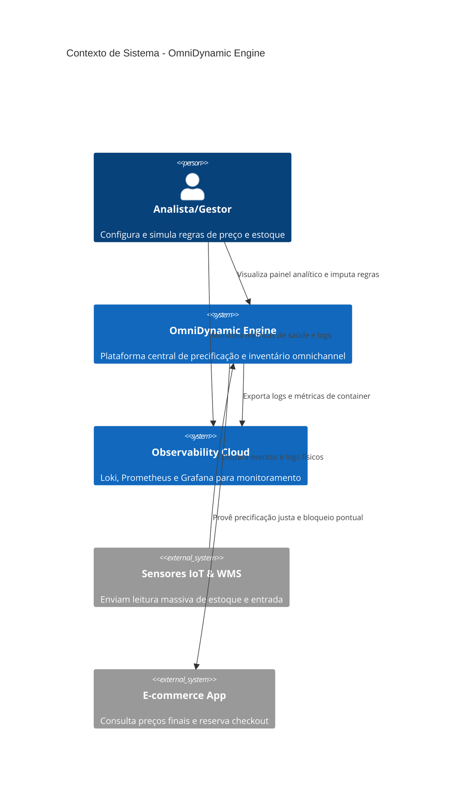
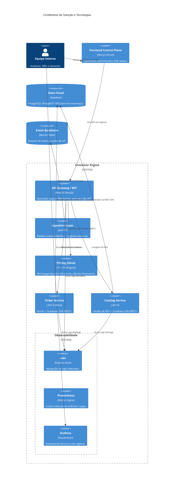
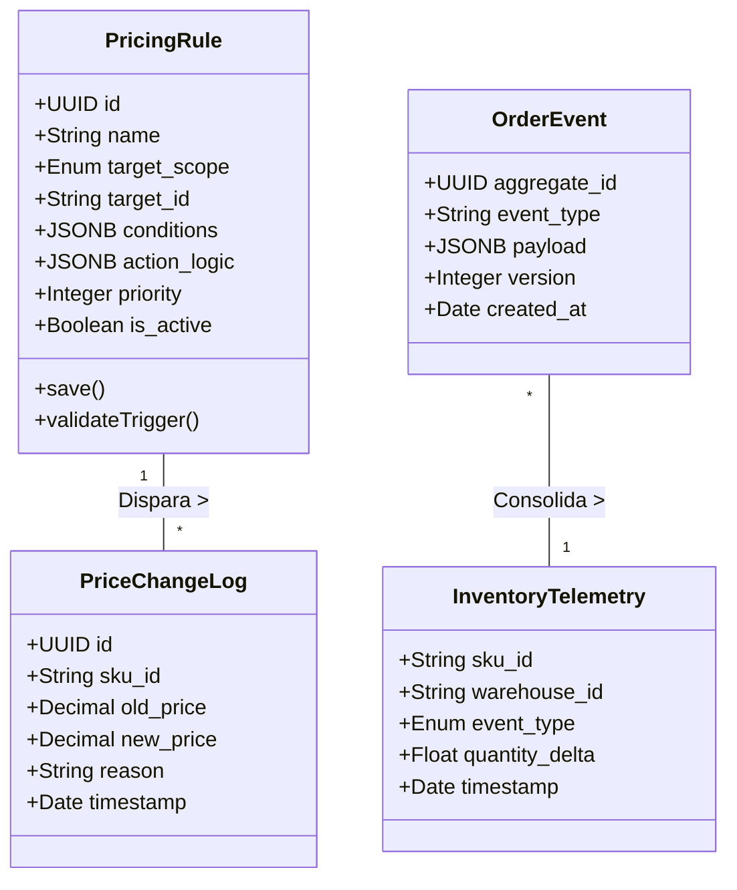
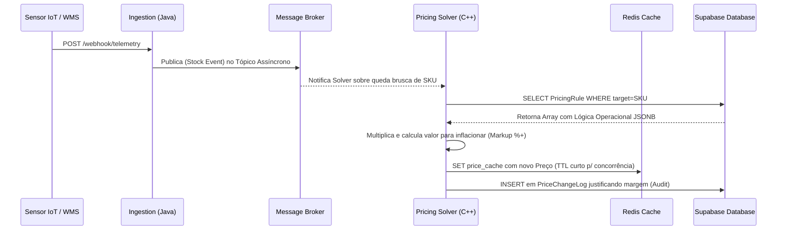
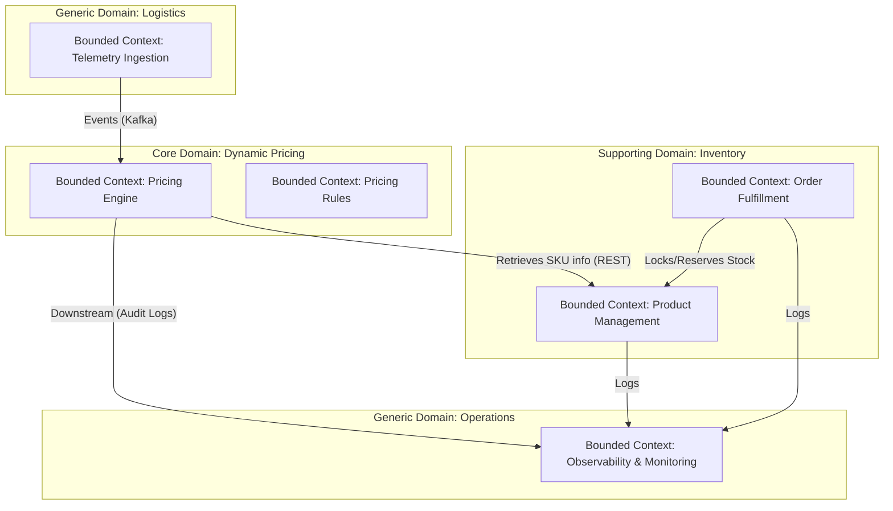

# OmniDynamic Engine - Documentação TOGAF e Arquitetura

Este documento consolida a arquitetura do projeto **OmniDynamic Engine** seguindo os preceitos do framework TOGAF, bem como os diagramas C4 e UML representativos. Toda a documentação foi baseada nas fontes e requisitos originais, atualizada com as decisões arquiteturais mais recentes.

---

## 1. Visão da Arquitetura (Fase A - Architecture Vision)

**Objetivo Central:** 
Prover uma plataforma ultra-escalável capaz de resolver o desafio de precificação dinâmica e gestão de inventário em tempo real para o varejo global. O sistema toma decisões preditivas e adapta preços em milissegundos.

**Stakeholders Principais:**
- **Analista de Preços:** Configura lógicas de alteração e regras.
- **Gestor Comercial:** Simula estratégias de impactos financeiros.
- **Engenheiro de SRE:** Monitora infraestrutura global e latência crítica (P99).
- **Auditor de Compliance:** Fiscaliza histórico de transações e precificação justificada.
- **Desenvolvedor do E-commerce:** Utiliza APIs para prover os preços finais e reservar estoque em tempo real.

---

## 2. Arquitetura de Negócios (Fase B - Business Architecture)

O fluxo de negócio está focado na automação de processos inteligentes baseados em IoT (WMS/ERP) para a ponta do consumidor final (plataforma e-commerce).

**Capacidades Principais de Negócio:**
1. **Precificação Dinâmica:** O sistema avalia estoques e ações de concorrentes e, de forma não impeditiva, altera percentuais de lucro sob regras booleanas compostas (**RF01**).
2. **Impacto e Simulação (Sandboxing):** Validação segura (backtesting) de novas configurações sem afetar o faturamento da empresa em produção (**RF02 / US02**).
3. **Gerenciamento de Inventário Omnichannel:** Recebe ingestão massiva de armazéns (WMS) e trava estoques temporariamente (TTL) por cada requisição de checkout para não frustrar o consumidor final (**RF04, RF05, RF06**).
4. **Trilhas de Auditoria Regulatória:** Registro fiel imutável do ciclo de vida das mudanças, indicando exatamente quando, como e o motivo de uma flutuação (>50%) ser aceita pelo sistema (**RF07, RF11**).

---

## 3. Arquitetura de Sistemas de Informação (Fase C - Information Systems Architecture)

### 3.1 Arquitetura de Aplicação (Application Architecture)

A lógica de aplicação distribui componentes visando a extração máxima de performance. 
- **API Gateway / BFF (Node.js/NestJS):** Orquestra tráfego externo, lida com segredos, WebSockets e autenticação HTTP segura.

- **Ingestion Layer (Java 21 / Spring WebFlux):** Escuta de forma assíncrona todas as batidas e eventos do IoT. Não bloqueante por natureza.

- **Pricing Solver (C++ 20 / Drogon):** Algoritmo de performance extrema projetado para rodar os cálculos matemáticos e entregar respostas em <15ms.
- **Order Service (.NET 8):** Adota o *Modelo de Atores* via Akka.NET para gestão de reservas de estoque. Utiliza o **Supabase C# SDK** para persistência via PostgREST, garantindo estabilidade em ambientes de rede restritos e alta fidelidade com os tipos de dados do BaaS.
- **Catalog Service (.NET 8):** Microsserviço de gestão de SKU e auditoria de estoque. Também migrado de EF Core para o **Supabase SDK** nativo.
- **Dashboard Institucional & Control Plane:** Realizado em **Next.js 14**.

### 3.2 Arquitetura de Dados (Data Architecture)

Todas as áreas convergem para um back-end robusto, com a substituição das ramificações isoladas do banco de dados relacional para o **Supabase** centralizado (PostgreSQL as a Service):
- **O Supabase como SOT (Source of Truth):** Abriga as `pricing_rules`, guarda os logs no esquema `audit` (`price_change_logs`). A comunicação é realizada prioritariamente via HTTPS/REST (PostgREST) para evitar overhead de conexões TCP em redes bridge (Docker).
- **Message Backbone (Apache Kafka):** Garante buffer e roteamento (Pub/Sub AsyncAPI) do excesso global da ingestão para que o banco não colapse nas janelas críticas.
- **Cache Layer (Redis):** Gerencia locks otimistas curtos (`inventory_lock:{sku}`) e provê a cópia do cálculo final (`price:{sku_id}`) por segundos limitados (TTL 5s) à borda.

---

## 4. Arquitetura Tecnológica (Fase D - Technology Architecture)

A infraestrutura foi desenhada para a era Cloud-Native:
- **Hospedagem Front-end:** O Dashboard em Next.js e seus server-components/SSR são servidos através da **Vercel**.
- **BaaS e Database:** **Supabase**, lidando com dados persistentes PostgreSQL, atuando como core da infraestrutura relacional.
- **Observabilidade:** Stack local de monitoramento composta por **Grafana**, **Prometheus**, **cAdvisor**, **Loki** e **Promtail**, permitindo visibilidade de métricas de hardware (CPU/RAM) e logs centralizados de todos os microserviços.
- **Orquestração de Microserviços:** Todos os microserviços são conteinerizados via Docker. Em produção, são gerenciados no ecossistema do **Kubernetes (K8s)**.

---

## 5. Diagramas C4

Para carregar estes diagramas nativamente em repositórios Markdown, utilizamos Mermaid:

### 5.1 Diagrama de Contexto (C4 Nível 1)

### 5.2 Diagrama de Contêiners (C4 Nível 2)

---

## 6. Diagramas UML

### 6.1 Diagrama de Classe (Domínio de Dados)
Representação orientada a objetos das entidades que fluem de dentro do **Supabase** e Atores.

### 6.2 Diagrama de Sequência (Recalculo Baseado no Status de Inventário)
Demonstrando o isolamento entre K8s Backend Services atuando no Supabase.

---

## 7. Arquitetura Estratégica (DDD)

A decomposição do sistema segue os princípios do **Domain-Driven Design (DDD)** para garantir o desacoplamento e a especialização das regras de negócio.

### 7.1 Classificação de Subdomínios

1.  **Core Domain (Domínio Central):** **Dynamic Pricing**. É o "coração" do OmniDynamic Engine, onde reside o diferencial competitivo da precificação preditiva.
2.  **Supporting Subdomains (Domínios de Suporte):** 
    -   **Catalog & Inventory:** Fornece o mestre de produtos e saldos base para os cálculos.
    -   **Orders & Fulfillment:** Gerencia o ciclo de vida da reserva e o estado transacional do estoque.
3.  **Generic Subdomains (Domínios Genéricos):**
    -   **Telemetry Ingestion:** Lida com a complexidade técnica de ingestão massiva de IoT, independente das regras de preço.
    -   **Observability:** Stack de monitoramento (Loki/Prometheus).

### 7.2 Mapa de Contexto (Context Map)

### 7.3 Linguagem Ubíqua (Glossário Resumido)
-   **SKU (Stock Keeping Unit):** Identificador único de produto para cálculo.
-   **Price Rule:** Gatilho booleano que determina quando um preço deve mudar.
-   **Lock:** Bloqueio temporário de estoque durante o checkout (TTL-based).
-   **Telemetry:** Batidas de sensores IoT representando movimentação física.
