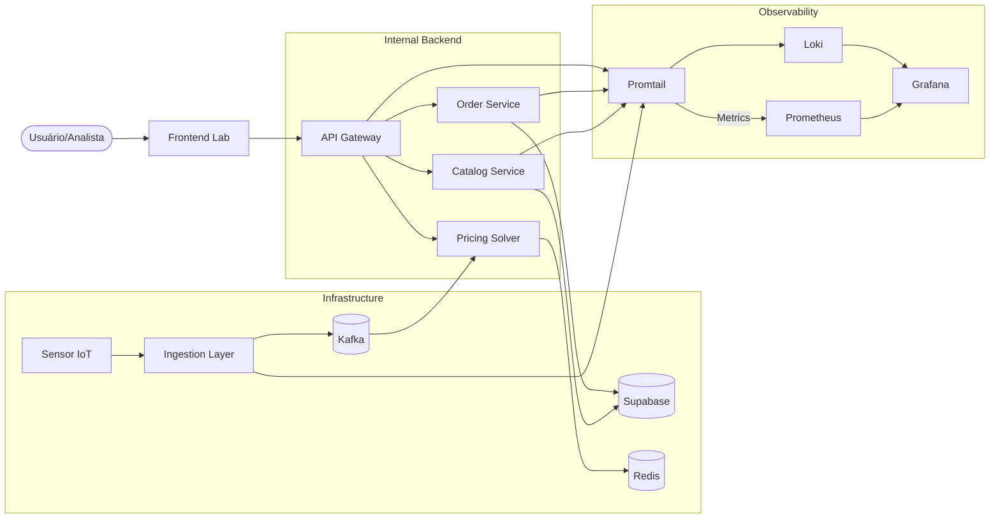

# Fluxo de Conexões

O diagrama abaixo ilustra como os microserviços interagem entre si, utilizando o **API Gateway** como mediador de tráfego externo e o **Message Broker** para desacoplamento assíncrono.

### Detalhes de Integração
- **HTTP/REST (Swagger):** Entre Gateway e serviços internos (Catalog/Order).
- **gRPC:** Comunicação ultra rápida entre Gateway e Pricing Solver.
- **AMQP/Kafka:** Entrega de eventos de telemetria IoT.
- **REST/HTTPS:** Serviços C# falando diretamente com o Supabase via SDK nativo.
